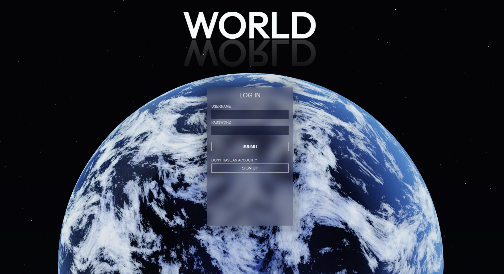

# WORLD
### *Project "World"* - Flask app with Phyton + PostgreSQL
 

  This is the log in/sign up page
  

 

  This is the home page where you can search for information about countries. Data about countries is scrapped from Wikipedia
  

 

  You can check the current time in any country in the world
  

  This is again a scrapped informtion from Wikipedia - this time a table that is displaying population in all countries of the world
  

